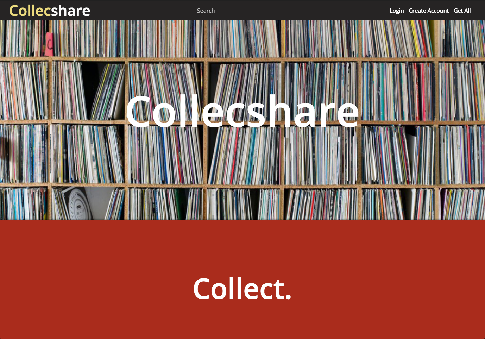

# Collecshare

This app allows users to sign up for and/ or sign in to account, customize a profile, and upload images and information about their collections. Users can also browse collections by category and view other user's profiles and collection details.

## Getting Started

To get the app up and running, enter the following commands in the terminal:

```
git clone https://github.com/dsdunn/collecshare
cd collecshare
npm install
npm start
```

## Running the tests

The testing suite is built with Enzyme and Jest. To run:

```
npm test
```


## Built With

* [React](https://reactjs.org/) - (create-react-app)
* [React-Router](https://reacttraining.com/react-router/web/guides/philosophy) 
* [Redux](https://redux.js.org/)
* [FireBase Authentication](https://firebase.google.org)


## Authors

* **David Starr Dunn** - *Initial work* - [@dsdunn](https://github.com/dsdunn)
* **Spenser Leighton** - *Initial work* - [@spenserleighton1](https://github.com/spenserleighton1)
* **Adam Lusk** - *Initial work* - [@Vadlusk](https://github.com/vadlusk)




    


